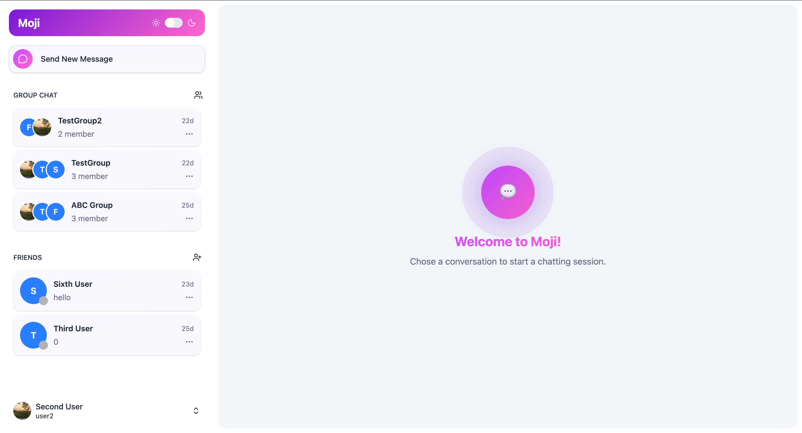

# Moji - Real time chat app

Live demo: [App](https://moji-real-time-chat-app-frontend-26o9lh6ro-true203s-projects.vercel.app/)
Notes: Becasue I'm using the render hobby package so the backend may need 2 mins to restart

## Description
A modern, full-stack real-time application built with the MERN stack, featuring secure authentication and a highly responsive UI. Applying the CRUD of the http protocals.




## Tech stack
- React
- Mongodb
- Express
- JWT
- Shadcd
- TailwindCSS

## Features
- Secure Authentication: Robust user login and registration using JWT and HTTP-only cookies.

- Real-Time Interactivity: Seamless data updates and state management.

- Modern UI/UX: Built with Shadcn UI components and styled with Tailwind CSS for a clean, accessible, and responsive design.

- Scalable Database: Flexible data storage with MongoDB.

- RESTful API: Clean separation of concerns between the client and server.

## Installation (The back end and frontend a seprated)
### Backend
- Install the dependencies: `npm install`
- Set up environment variables (you can get the mongodb, cloudinary on the web with you account):
```
PORT=5001
MONGODB_CONNECTIONSTRING
CLIENT_URL=http://localhost:5173
ACCESS_TOKEN_SECRET=d46ca3f984790b787c4f221885d624f36215b47524ad6431d454b46fe04e4d995fc48c9f19515f4c61a7225af1a4595093dd9334bc4d35dce294f6468b206c1a
CLOUDINARY_CLOUD_NAME
CLOUDINARY_API_KEY
CLOUDINARY_API_SECRET
```
- Run the backend: `npm run dev`

### Frontend
- Install the dependencies: `npm install`
- Set up environment variables:
```
VITE_API_URL=http://localhost:5001/api
VITE_SOCKET_URL=http://localhost:5001/
```
- Run the frontend: `npm run dev`
